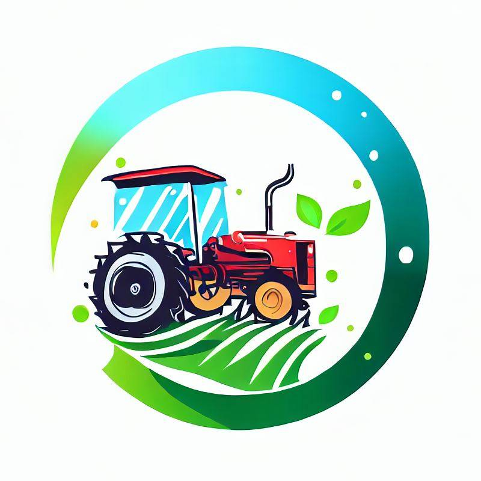

# Sklep Internetowy (AgroPol - Sprzedawca Produktów Rolniczych)

## Problematyka

Brak możliwości:

- zakupu nowych maszyn rolniczych poprzez Internet
- dostawy maszyn rolniczych po zamówieniu przez Internet na adres kupującego
- dostosowania wyposażenia sprzętu rolniczego przy zakupach online
- sprawdzenia ceny nowych maszyn rolniczych
- sprowadzenia nowych maszyn rolniczych z zagranicy
- zakupu nawozów rolniczych online z dostawą

## Rozwiązanie problemów

- stworzenie sklepu internetowego z produktami rolniczymi
- uwzględnienie wszystkich dodatkowych opłat do ceny produktu (w tym VAT i cło)
- możliwość dostawy na adres kupującego za dodatkową opłatą (83 grosze za kilometr)
- kupujący otrzyma maila z fakturą, dzięki której będzie mógł odliczyć stawkę VAT
- stworzenie koszyku z produktami dla każdego z użytkowników w celu ułatwienia zakupów
- możliwość dostosowania wyposażenia maszyn rolniczych oraz ich poszczególna cena

## Zalety

- schludna kolorystyka i przyjazny interfejs dla użytkownika
- podział wszystkich produktów na kategorie w celu ułatwienia wyszukiwani
- zniżka na zakupy powyżej trzech produktów
- wyliczenie wszystkich kosztów przed dokonaniem zakupu
- dostawa bez VAT
- przedstawienie ceny netto i brutto
- dostawa do każdego zakątka świata

## Podsumowanie

Projekt zakłada stworzenie sklepu internetowego do sprzedaży produktów rolniczych nowych i używanych. Wszystkie działania będą odbywać się poprzez sklep internetowy oraz po dokonaniu zakupu będzie dostępna możliwość dostawy na adres kupującego. Każdy produkt będzie posiadał cenę rynkową.
